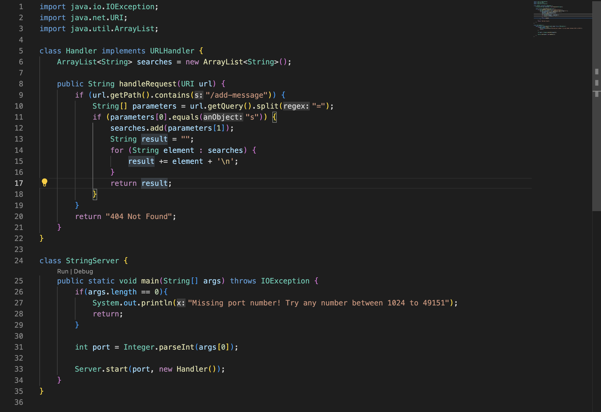
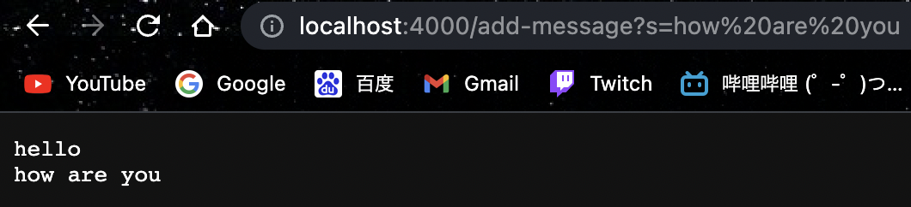

# Lab Report 2 - Servers and Bugs (Week 3)
## Part 1 - String Server
For this part, I based my implementation of String Server on the NumberServer.java provided during the lab:



I tested out my code by opening a local server on port 4000 and added two strings:


- Which methods in your code are called?

The handleRequest method is called upon entering the local server

- What are the relevant arguments to those methods, and the values of any relevant fields of the class?

  - `searches` is the ArrayList containing all added messages. 
  - `url` is the url input, typically entered as `localhost:(port number)/add-message?=(message)`. 
  - `parameters` is the the array of strings containing the url split up on `=`. 
  - `result` is the collection of all added messages used to display the messages

- How do the values of any relevant fields of the class change from this specific request? If no values got changed, explain why.
  - `url` becomes `localhost:4000/add-message?s=hello`.
  - `parameters` becomes `localhost:4000/add-message?s` and `hello`.
  - `searches` becomes `hello`.
  - `result` becomes `hello \n`.
  - `element` becomes `hello`.
 
 
 
- Which methods in your code are called?
  - The handleRequest method is called upon entering the local server

- What are the relevant arguments to those methods, and the values of any relevant fields of the class?
  - `searches` is the ArrayList containing all added messages. 
  - `url` is the url input, typically entered as `localhost:(port number)/add-message?=(message)`. 
  - `parameters` is the the array of strings containing the url split up on `=`. 
  - `result` is the collection of all added messages used to display the messages

- How do the values of any relevant fields of the class change from this specific request? If no values got changed, explain why.
  - `url` becomes `localhost:4000/add-message?s=how are you`.
  - `parameters` becomes `localhost:4000/add-message?s` and `how are you`.
  - `searches` becomes `hello \n how are you \n`.
  - `result` becomes `hello \n how are you \n`.
  - `element` becomes `how are you`.

## Part 2 - Analyzing bugs and symptoms
The buggy code that will be analyzed here will be the reverse method in ArrayExamples.java

- A failure inducing input:
  ```
  @Test
  public void testReversed2() {
    int[] input1 = {1, 2, 3};
    assertArrayEquals(new int[]{3, 2, 1}, ArrayExamples.reversed(input1));
  }
  ```
  
- A non-failing input:
  ```
  @Test
  public void testReversed1() {
    int[] input1 = {0};
    assertArrayEquals(new int[]{0}, ArrayExamples.reversed(input1));
  }
  ```

- The symptoms, as the output of the tests:
  

- The bug and the fix:
  Before:
  ```
  static int[] reversed(int[] arr) {
    int[] newArray = new int[arr.length];
    for(int i = 0; i < arr.length; i += 1) {
      arr[i] = newArray[arr.length - i - 1];
    }
    return arr;
  }
  ```
  
  After:
  ```
  static int[] reversed(int[] arr) {
    int[] newArray = new int[arr.length];
    for(int i = 0; i < arr.length; i += 1) {
      newArray[i] = arr[arr.length - i - 1];
    }
    return newArray;
  }
  ```


## Part 3 - Afterthoughts 


